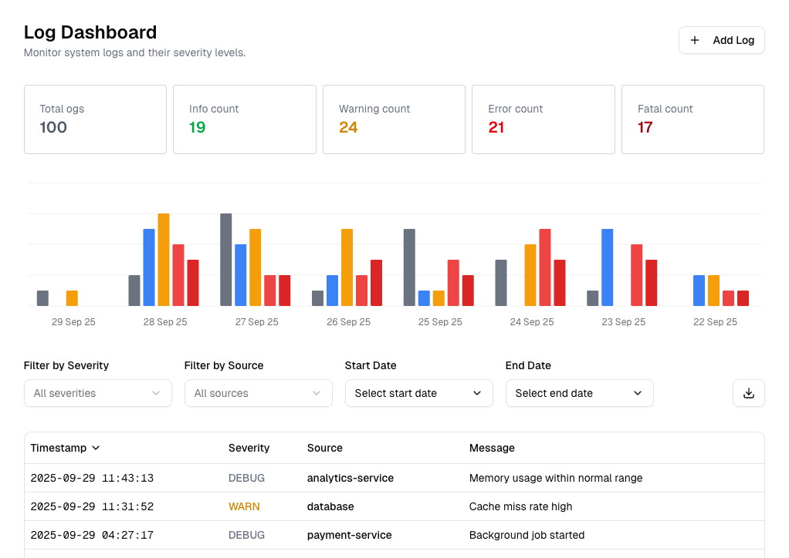

# Log Dashboard



## Features
- Shadcn UI for UI components and charts
- FastAPI backend with Prisma ORM
- Frontend built with Next.js and Tailwind CSS
- Endpoint to generate random logs for testing purposes
- UV modern package manager for Python dependencies

## Getting Started
To quickly get started with the Log Dashboard application, you can run docker compose with this command:

```bash
docker compose up --build
```

## Backend

### Running database migrations
You can run the following commands to apply database migrations:
```bash
cd services/backend
uv sync
uv run prisma migrate dev
uv run prisma generate
```

### Starting the backend server

Navigate to the `services/backend` directory and run the following command:

```bash
uv run uvicorn main:app --reload --host 0.0.0.0 --port 8000
```

Make sure you have completed the env values. You can refer to `.env.example` for the required environment variables.

### Create Log Entry

To create a log entry, you can use the following API endpoint using a tool like `curl` or Postman:

```bash
curl -X POST "http://localhost:8000/api/v1/logs" -H "Content-Type: application/json" -d '{
    "timestamp": "2023-10-01T12:00:00Z",
    "severity": "INFO",
    "message": "This is a test log message",
    "source": "test-service"
}'
```

### Generate Random Logs

To generate random log entries, you can use the following API endpoint:

```bash
curl -X POST "http://localhost:8000/api/v1/logs/generate" -H "Content-Type: application/json" -d '{
    "count": 10,
    "days_back": 7
}'
```

### Retrieve Logs

To retrieve logs with optional filtering, you can use the following API endpoint:

```bash
curl -X GET "http://localhost:8000/api/v1/logs?severity=ERROR&source=test-service&start_date=2023-09-01T00:00:00Z&end_date=2023-10-01T23:59:59Z&limit=50&offset=0"
```

### Update log by ID

To update a log entry by its ID, you can use the following API endpoint:

```bash
curl -X PUT "http://localhost:8000/api/v1/logs/d991e790-9d00-11f0-b405-ba7ac230cb3c" -H "Content-Type: application/json" -d '{
    "severity": "WARN",
    "source": "updated-service",
    "message": "Updated log message"
}'
```

### Delete log by ID

To delete a log entry by its ID, you can use the following API endpoint:

```bash
curl -X DELETE "http://localhost:8000/api/v1/logs/d991e790-9d00-11f0-b405-ba7ac230cb3c"
```

### Get Aggregated Logs
To retrieve aggregated log data, you can use the following API endpoint:

```bash
curl -X GET "http://localhost:8000/api/v1/logs/aggregated?severity=ERROR&source=test-service&start_date=2023-09-01T00:00:00Z&end_date=2023-10-01T23:59:59Z"
```

## Frontend
### Starting the frontend server
Navigate to the `services/frontend` directory and run the following command:

```bash
cd services/frontend
pnpm install
pnpm dev
```

Make sure you have completed the env values. You can refer to `.env.example` for the required environment variables.
